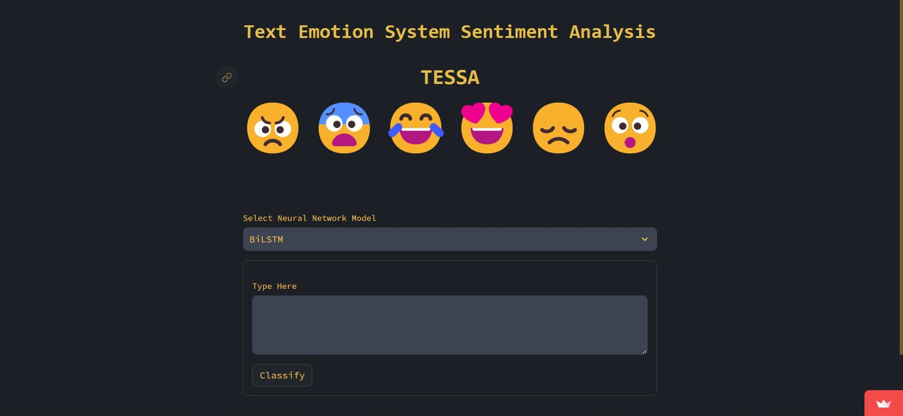

<a name="readme-top"></a>

[![Contributors][contributors-shield]][contributors-url]
[![Forks][forks-shield]][forks-url]
[![Stargazers][stars-shield]][stars-url]
[![Issues][issues-shield]][issues-url]
[![MIT License][license-shield]][license-url]
[![LinkedIn][linkedin-shield]][linkedin-url]
[![GitHub][github-shield]][github-url]

# [TESSA](https://tessa-deployed.streamlit.app) | Text Emotion System Sentiment Analysis

<br />
<div align="center">
  <a href="https://tessa-deployed.streamlit.app">
    
  </a>

<h3 align="center">TESSA</h3>

  <p align="center">
    <b>TESSA</b> is a <b>Text Sentiment Analysis</b> project with main purpose to predict the <b>Emotion</b> conveyed from a text document. This project explores machine learning models for text emotion detection and classification. We aim to develop an efficient model for identifying emotions in text data, employing natural language processing. The models trained on labeled <b>Twitter(X) datasets</b> find applications in customer service, social media monitoring, marketing analysis, and various other uses. We mainly hope to utilize this emotion detection as a marketing tool to analyze customer perceptions gathered from reviews, tweets, and customer service interactions. This approach will help clients understand their sentiments within their customer base, enabling targeted strategies aligned with their experiences and expectations. We examine and create eight models to determine the most effective approach for emotion detection. We successfully developed our business tool, with the <b>Bidirectional LSTM</b> emerging as the top-performing model with an accuracy of <b>92.88%</b>.
    <br />
    <a href="https://github.com/GeorgiosIoannouCoder/tessa"><strong>Explore the docs »</strong></a>
    <br />
    <br />
    <a href="https://tessa-deployed.streamlit.app">View Web Application</a>
    ·
    <a href="https://github.com/GeorgiosIoannouCoder/tessa/issues">Report Bug</a>
    ·
    <a href="https://github.com/GeorgiosIoannouCoder/tessa/issues">Request Feature</a>
  </p>
</div>

<details>
  <summary>Table of Contents</summary>
  <ol>
    <li>
      <a href="#about-the-project">About The Project</a>
      <ul>
        <li><a href="#application-user-interface">Application User Interface</a></li>
        <li><a href="#key-features">Tasks</a></li>
        <li><a href="#dataset">Dataset</a></li>
        <li><a href="#models-built">Models Built</a></li>
        <li><a href="#built-with">Built With</a></li>
      </ul>
    </li>
    <li>
      <a href="#getting-started">Getting Started</a>
      <ul>
        <li><a href="#prerequisites">Prerequisites</a></li>
        <li><a href="#setup">Setup</a></li>
      </ul>
    </li>
    <li><a href="#usage">Usage</a></li>
    <li><a href="#code">Code</a></li>
    <li><a href="#report">Report</a></li>
    <li><a href="#contributing">Contributing</a></li>
    <li><a href="#license">License</a></li>
    <li><a href="#contact">Contact</a></li>
  </ol>
</details>

## About The Project

  <a href="https://tessa-deployed.streamlit.app">
      
  </a>

### Application Graphical User Interface

 <a href="https://tessa-deployed.streamlit.app">
    
 </a>

<p align="right"><a href="#readme-top">Back to top</a></p>

### Tasks

| Tasks |
| ----- |
| Create Github Repository |
| Brainstorm Project |
| Find Dataset |
| EDA |
| Data Preprocessing |
| Data Modeling: Random forest, Decision Tree |
| Data Modeling: Logistic Regression , SVM |
| Data Modeling: BiLSTM, CNN, CNN+LSTM, MNB |
| Model Evaluation|
| Streamlit Application|

<p align="right"><a href="#readme-top">Back to top</a></p>

### Dataset

**[`Emotions Dataset For NLP`](https://www.kaggle.com/datasets/praveengovi/emotions-dataset-for-nlp)**
- 2 Columns:
  - Content
  - Sentiment
- 20,000 rows

<p align="right"><a href="#readme-top">Back to top</a></p>

### Models Built (Click on the model that you are interested)

1. [Bidirectional LSTM (BiLSTM)](https://github.com/GeorgiosIoannouCoder/tessa/blob/main/code/models/neural_networks/bidirectional_lstm/build_and_train_bidirectional_long_short_term_memory_model.ipynb)
2. [Convolutional Neural Network (CNN)](https://github.com/GeorgiosIoannouCoder/tessa/blob/main/code/models/neural_networks/cnn/build_and_train_convolutional_neural_network_model.ipynb)
3. [CNN + LSTM](https://github.com/GeorgiosIoannouCoder/tessa/blob/main/code/models/neural_networks/cnn_lstm/build_and_train_cnn_lstm_model.ipynb)
4. [Multinomial Naive Bayes (MNB)](https://github.com/GeorgiosIoannouCoder/tessa/blob/main/code/models/mnb/build_and_train_multinomial_naive_bayes_model.ipynb)
5. [Decision Tree](https://github.com/GeorgiosIoannouCoder/tessa/blob/main/code/models/decision_tree/decision_tree.ipynb)
6. [Random Forest](https://github.com/GeorgiosIoannouCoder/tessa/blob/main/code/models/random_forest/random_forest.ipynb)
7. [Logistic Regression](https://github.com/GeorgiosIoannouCoder/tessa/blob/main/code/models/logistic_regression/logistic_regression.ipynb)
8. [Support Vector Machine (SVM)](https://github.com/GeorgiosIoannouCoder/tessa/blob/main/code/models/svm/support_vector_machine.ipynb)

<p align="right"><a href="#readme-top">Back to top</a></p>

### Built With

[![Python][Python]][Python-url]
[![Pandas][Pandas]][Pandas-url]
[![Numpy][Numpy]][Numpy-url]
[![scikitlearn][scikitlearn]][scikitlearn-url]
[![Nltk][Nltk]][Nltk-url]
[![Tensorflow][Tensorflow]][Tensorflow-url]
[![Streamlit][Streamlit]][Streamlit-url]
[![Matplotlib][Matplotlib]][Matplotlib-url]
[![Seaborn][Seaborn]][Seaborn-url]
[![Plotly][Plotly]][Plotly-url]
[![Kaggle][Kaggle]][Kaggle-url]

<p align="right"><a href="#readme-top">Back to top</a></p>

## Getting Started

**To get a local copy of TESSA up and running locally follow these simple example steps:**

### Prerequisites

**NOTE:** How to check if Python is installed and what is its version

```sh
  python --version
```

**NOTE:** How to check if Git is installed and what is its version

```sh
  git -v
```

1. Please make sure you have pyenv installed and use Python3 version 3.11.0:

   - You can use pyenv to switch between different Python versions:
     - Windows: [https://www.youtube.com/watch?v=HTx18uyyHw8](https://github.com/pyenv-win/pyenv-win)
     - Mac: [https://www.youtube.com/watch?v=31WU0Dhw4sk](https://github.com/pyenv/pyenv)
     - Linux: [https://www.youtube.com/watch?v=1Zgo8M9yUtM](https://github.com/pyenv/pyenv)

2. Please make sure you have git installed

   - Windows: [https://git-scm.com/download/win](https://git-scm.com/download/win)
   - Mac: [https://git-scm.com/download/mac](https://git-scm.com/download/mac)
   - Linux: [https://git-scm.com/download/linux](https://git-scm.com/download/linux)

3. Please look at the [setup](https://github.com/GeorgiosIoannouCoder/tessa/tree/main/setup) folder found in this project to find the directions specific to your operating system. The general instructions can also be found below.

### Setup

1. Navigate to the directory where you want to clone/run/save the application:

   ```sh
   cd your_selected_directory
   ```

2. Clone this repository:

   ```sh
   git clone https://github.com/GeorgiosIoannouCoder/tessa.git
   ```

3. Navigate to the realesrgan git repository:

   ```sh
   cd tessa
   ```

4. Use Python3 3.11.0 version in the cloned repository folder:

   ```sh
   pyenv local 3.11.0
   ```

5. Create virtual environment in the cloned repository folder:

   ```sh
   python -m venv .tessa-venv
   ```

6. Activate the virtual environment (Windows OR Mac/Linux):

   1. Windows

   ```sh
   .\.tessa-venv\Scripts\activate
   ```

   2. Mac/Linux

   ```sh
   source .tessa-venv/bin/activate
   ```

7. Install the dependencies listed in the requirements.txt file:

   ```sh
   pip install -r requirements.txt
   ```

8. Run Streamlit:

   ```sh
   streamlit run app.py
   ```

9. To Run The Notebooks (3 Options):
   1. Use [Kaggle](https://www.kaggle.com/)
   2. Use [Jupyter Notebboks Extension for VS Code](https://code.visualstudio.com/docs/datascience/jupyter-notebooks)
   3. Use [Anaconda](https://www.anaconda.com/)
       1. Download and install [Anaconda](https://www.anaconda.com/download)
       2. Launch a jupyter notebook:
           1. MacOS users, open up terminal and type in `jupyter notebook`
           2. Window users, open up your Anaconda Power Shell, and type in `jupyter notebook`

<p align="right"><a href="#readme-top">Back to top</a></p>

## Code

The full project code with all the Plotly interactive graphs can be found [here](https://nbviewer.org/github/GeorgiosIoannouCoder/tessa/blob/main/code/tessa_full_notebook.ipynb).

<p align="right"><a href="#readme-top">Back to top</a></p>

## Report

Project Final Report is located [here](https://github.com/GeorgiosIoannouCoder/tessa/blob/main/report/Ioannou_Georgios_Report.pdf).

<p align="right"><a href="#readme-top">Back to top</a></p>

## Contributing

Contributions are what make the open source community such an amazing place to learn, inspire, and create. Any contributions you make are **greatly appreciated**.

If you have a suggestion that would make this better, please fork the repo and create a pull request. You can also simply open an issue with the tag "enhancement".
Don't forget to give the project a star! Thanks again!

1. Fork the Project
2. Create your Feature Branch (`git checkout -b feature/AmazingFeature`)
3. Commit your Changes (`git commit -m 'Add some AmazingFeature'`)
4. Push to the Branch (`git push origin feature/AmazingFeature`)
5. Open a Pull Request

<p align="right"><a href="#readme-top">Back to top</a></p>

## License

Distributed under the MIT License. See [LICENSE](https://github.com/GeorgiosIoannouCoder/tessa/blob/master/LICENSE) for more information.

MIT License

Copyright (c) 2023 Georgios Ioannou

Permission is hereby granted, free of charge, to any person obtaining a copy
of this software and associated documentation files (the "Software"), to deal
in the Software without restriction, including without limitation the rights
to use, copy, modify, merge, publish, distribute, sublicense, and/or sell
copies of the Software, and to permit persons to whom the Software is
furnished to do so, subject to the following conditions:

The above copyright notice and this permission notice shall be included in all
copies or substantial portions of the Software.

THE SOFTWARE IS PROVIDED "AS IS", WITHOUT WARRANTY OF ANY KIND, EXPRESS OR
IMPLIED, INCLUDING BUT NOT LIMITED TO THE WARRANTIES OF MERCHANTABILITY,
FITNESS FOR A PARTICULAR PURPOSE AND NONINFRINGEMENT. IN NO EVENT SHALL THE
AUTHORS OR COPYRIGHT HOLDERS BE LIABLE FOR ANY CLAIM, DAMAGES OR OTHER
LIABILITY, WHETHER IN AN ACTION OF CONTRACT, TORT OR OTHERWISE, ARISING FROM,
OUT OF OR IN CONNECTION WITH THE SOFTWARE OR THE USE OR OTHER DEALINGS IN THE
SOFTWARE.

<p align="right"><a href="#readme-top">Back to top</a></p>

## Contact

Georgios Ioannou - [@LinkedIn](https://linkedin.com/in/georgiosioannoucoder)

Project Link: [https://github.com/GeorgiosIoannouCoder/tessa](https://github.com/GeorgiosIoannouCoder/tessa)

<p align="right"><a href="#readme-top">Back to top</a></p>

[contributors-shield]: https://img.shields.io/github/contributors/GeorgiosIoannouCoder/tessa.svg?style=for-the-badge
[contributors-url]: https://github.com/GeorgiosIoannouCoder/tessa/graphs/contributors

[forks-shield]: https://img.shields.io/github/forks/GeorgiosIoannouCoder/tessa.svg?style=for-the-badge
[forks-url]: https://github.com/GeorgiosIoannouCoder/tessa/network/members

[stars-shield]: https://img.shields.io/github/stars/GeorgiosIoannouCoder/tessa.svg?style=for-the-badge
[stars-url]: https://github.com/GeorgiosIoannouCoder/tessa/stargazers

[issues-shield]: https://img.shields.io/github/issues/GeorgiosIoannouCoder/tessa.svg?style=for-the-badge
[issues-url]: https://github.com/GeorgiosIoannouCoder/tessa/issues

[license-shield]: https://img.shields.io/github/license/GeorgiosIoannouCoder/tessa.svg?style=for-the-badge
[license-url]: https://github.com/GeorgiosIoannouCoder/tessa/blob/master/LICENSE

[linkedin-shield]: https://img.shields.io/badge/-LinkedIn-black.svg?style=for-the-badge&logo=linkedin&colorB=0077B5
[linkedin-url]: https://linkedin.com/in/georgiosioannoucoder

[github-shield]: https://img.shields.io/badge/-GitHub-black.svg?style=for-the-badge&logo=github&colorB=000
[github-url]: https://github.com/GeorgiosIoannouCoder/

[Python]: https://img.shields.io/badge/python-FFDE57?style=for-the-badge&logo=python&logoColor=4584B6
[Python-url]: https://www.python.org/

[Pandas]: https://img.shields.io/badge/pandas-150458?style=for-the-badge&logo=pandas&logoColor=white
[Pandas-url]: https://pandas.pydata.org/

[Numpy]: https://img.shields.io/badge/numpy-%23013243.svg?style=for-the-badge&logo=numpy&logoColor=white
[Numpy-url]: https://numpy.org/

[scikitlearn]: https://img.shields.io/badge/scikitlearn-000000?style=for-the-badge&logo=scikitlearn&logoColor=ffa500
[scikitlearn-url]: https://scikit-learn.org/stable/

[Nltk]: https://img.shields.io/badge/nltk-154f5b?style=for-the-badge&logo=nltk&logoColor=ffa500
[Nltk-url]: https://www.nltk.org/

[Tensorflow]: https://img.shields.io/badge/tensorflow-000000?style=for-the-badge&logo=tensorflow&logoColor=ffa500
[Tensorflow-url]: https://www.tensorflow.org/

[Streamlit]: https://img.shields.io/badge/streamlit-ffffff?style=for-the-badge&logo=streamlit&logoColor=ff0000
[Streamlit-url]: https://streamlit.io/

[Matplotlib]: https://img.shields.io/badge/matplotlib-3761a3?style=for-the-badge&logo=matplotlib&logoColor=white
[Matplotlib-url]: https://matplotlib.org/

[Seaborn]: https://img.shields.io/badge/seaborn-7db0bc?style=for-the-badge&logo=seaborn&logoColor=white
[Seaborn-url]: https://seaborn.pydata.org/

[Plotly]: https://img.shields.io/badge/plotly-000000?style=for-the-badge&logo=plotly&logoColor=white
[Plotly-url]: https://plotly.com/

[Kaggle]: https://img.shields.io/badge/kaggle-000000?style=for-the-badge&logo=kaggle&logoColor=20beff
[Kaggle-url]: https://www.kaggle.com/